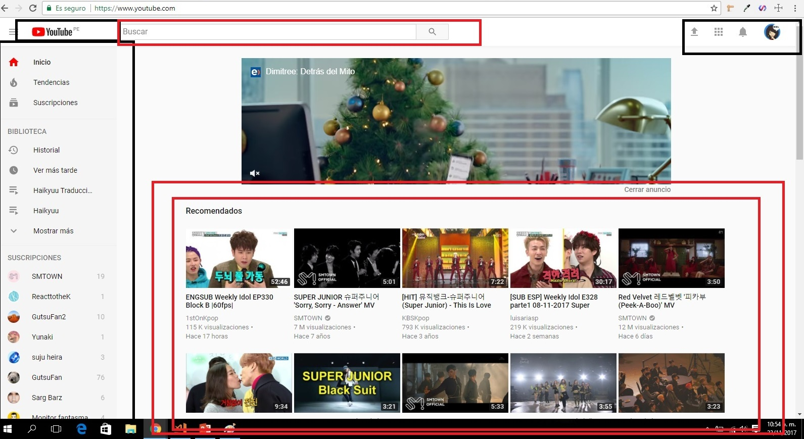

# Reto de código 1: 

## Descripción del reto:

Elegir una web de tu preferencia y explicar qué partes conforman el UX y qué partes el UI.

## YouTube

## Figura N° 1:

### UX  (Son las partes delineadas con color rojo)

1. Que exista un botón con el logo de la aplicación, para volver siempre al inicio.

2. Que aparezca al inicio los videos recomendados según las anteriores visualizaciones del usuario.

3. Que haya un lugar donde se muestre los canales a los que está suscrito el usuario

4. Menú de opcines directas para los usos principales: subir videos, notificaciones y un botón para entrar al canal.

5. Un search para búsqueda directa, con el atributo de autocompletar

### UI  (Son las partes delineadas con color nego)

1. Diseño de los botones.

2. Uso de colores de la marca: rojo y gris

3. Diseño de los menus de navegación

4. La forma, tamaño y colores de los cuadros de videos.

