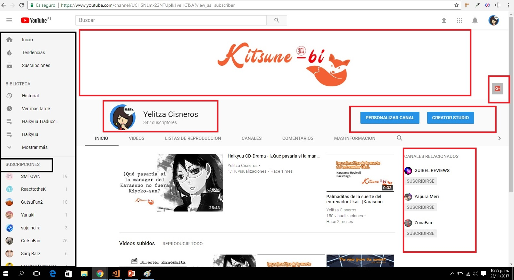
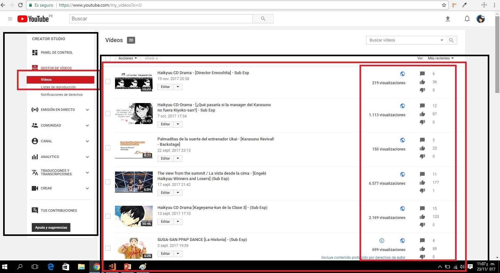

# Reto de código 1: 

## Descripción del reto:

Elegir una web de tu preferencia y explicar qué partes conforman el UX y qué partes el UI.

## YouTube

## Figura N° 1:

### UX  (Son las partes delineadas con color rojo)

1. Que exista un botón con el logo de la aplicación, para volver siempre al inicio.

2. Que aparezca al inicio los videos recomendados según las anteriores visualizaciones del usuario.

3. Que haya un lugar donde se muestre los canales a los que está suscrito el usuario

4. Menú de opcines directas para los usos principales: subir videos, notificaciones y un botón para entrar al canal.

5. Un search para búsqueda directa, con el atributo de autocompletar

### UI  (Son las partes delineadas con color negro)

1. Diseño de los botones.

2. Uso de colores de la marca: rojo y gris

3. Diseño de los menus de navegación

4. La forma, tamaño y colores de los cuadros de videos.

## Figura N° 2:

### UX  (Son las partes delineadas con color rojo)

1. Se mantienen los opciones de navegación principal: volver a la página de inicio, un search para buscar videos y las opciones del canal del usuario.

2. Poder pausar los videos y que cuando vuelva a ingresar a mi cuenta, este en el minuto donde me quedé

3. Que las opciones de "play" "siguiente video" y "audio", sean los principales en la ventana de reproductor del video

4. Tener la opción de reproducción automática.

5. Tener una lista de sugerencias de acuerdo al video que estoy viendo.

6. Tener la opción de dar like, dislike y/o guardar a los videos que se visualizan.

7. Tener un botón con el que pueda suscribirme al canal que subió el video.

8. Tamaño predeterminado del video a reproducir.

9. Opciones de tamaño de pantalla, subtitulado y settings. 

10. Información sobre el usuario que subió el video y la descripción del mismo.

### UI  (Son las partes delineadas con color negro)

1. Uso de los colores de la marca en la barra de visualización del video.

2. Forma y color de los botones de reproducción del video.

3. Forma de los íconos para calificar a los videos. Son fáciles de distinguir.

4. Resaltar el botón de suscripción con el uso del color de la marca.

5. Ordenamiento de los videos sugeridos. 

6. Diseño de presentación del usuario que subió el video y organización de la información.

7. Se resalta con el color rojo de la marca, el botón de activado.

## Figura N° 3:

### UX  (Son las partes delineadas con color rojo)

1. Posibilidad de poner una portada al perfil del usuario.

2. Posibildiad de poner una imagen de perfil del usuario.

3. Opciones de personalización del perfil.

4. Botón de acceso directo a los videos subidos.

5. Recomendación de canales con la misma temática.

### UI (Son las partes delineadas con color negro)

1. Ordenamiento y forma del perfil del usuario.

2. Uso de canales de marca.

3. Menu desplegable del canal.

4. Diseño de los botones del menú.

5. Se resalta la página en la que el usuario se encuentra.

## Figura N° 4:

### UX  (Son las partes delineadas con color rojo)

1. Se resalta la opción del menú al que el usuario ha accedido.

2. Visualización de los videos subidos.

3. Poder tener un resumen gráfico de los likes obtenidos, número de visualziaciones y comentarios. 

4. Opción de filtrar los videos subidos. 

### UI (Son las partes delineadas con color negro)

1. Ordenamiento y forma de las portadas de los videos subios y la interacción obtenida.

2. Uso de los colores de marca.

3. Diseño de los botones.

